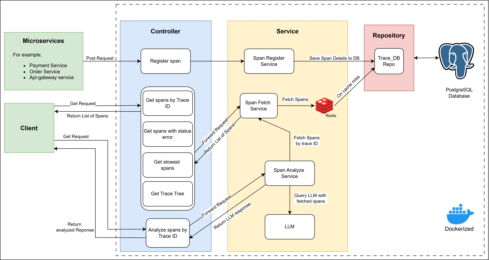

# Distributed Trace Tracker

In a microservice architecture, a single user request can touch multiple services before completing — and when something goes wrong, finding exactly where 
and why is painful without proper visibility. This project solves that problem by tracking the full execution journey of any request across services, 
giving engineers the tools to query, filter, and analyze traces. An AI-powered analysis engine examines the trace data and delivers a precise diagnosis of 
what went wrong and where. Three simulated microservices demonstrate the end-to-end flow.

---

## The Problem Addressed

In a distributed system, a single user request touches multiple services before completing. 
When something breaks or slows down, there is no single log file to look at — each service 
only knows its own piece of the story. Engineers end up manually correlating logs across 
services, which is time-consuming and error-prone.

This system solves that by collecting spans sent by microservices — each span carrying a 
shared trace ID — and stitching them together so engineers can instantly see the full 
request journey across services, identify which service failed, and pinpoint bottlenecks. 
An AI-powered analysis endpoint takes it further — pass a trace ID and get a structured diagnostic 
report identifying the likely root cause, reducing the need to manually read through.

---

## Features
- Collect and store span data from distributed microservices
- Query spans by trace, filter failures, and rank the slowest operations across services
- Reconstruct the full call hierarchy of any trace as a parent-child tree
- AI-assisted root cause analysis on any trace via Groq LLM
- Redis caching for repeated trace lookups
- Fully containerized — entire system starts with a single command!

---

## System Architecture

.

---

## Event Flow

1. A microservice handles a request and sends a span to the Trace Collector via POST /api/spans. All spans belonging 
   to the same request share a common trace ID.
   
2. The Trace Collector receives the span and saves it to PostgreSQL.
   
3. When an engineer queries a trace by ID, the collector first checks Redis. If the 
   trace is cached, it returns immediately without hitting the database. If not, it 
   fetches from PostgreSQL and caches the result in Redis for future lookups.
   
4. The engineer can query:
   - All spans for a specific trace ID
   - The full call hierarchy of a trace as a parent-child tree
   - All failed spans to identify what is currently broken
   - The slowest operations across all services to find performance bottlenecks
     
5. For any trace, the engineer can call the analyze endpoint. The collector fetches 
   the spans and sends them to an LLM, which returns a structured diagnostic report 
   identifying the likely root cause, how the failure propagated across services, 
   and any notable latency bottlenecks — or confirms the trace completed normally 
   if no issues are found.

---

   ## Live Demo Walkthrough

[View Demo →](./demo.pdf)

---

   ## Tech Stack


---

## API Reference

| Method | Endpoint | Description | Response |
|---|---|---|---|
| POST | `/api/spans` | Receive a span from a microservice and store it | `202 Accepted` |
| GET | `/api/traces/{traceId}` | Fetch all spans for a trace. Checks Redis first, falls back to PostgreSQL on cache miss | `200 OK` — list of spans,  `404` if trace not found |
| GET | `/api/traces/failed` | Fetch all spans with status ERROR | `200 OK` — list of spans,  `404` if trace not found |
| GET | `/api/traces/slowest` | Fetch all spans ordered by duration, slowest first | `200 OK` — list of spans,  `404` if trace not found |
| GET | `/api/traces/{traceId}/analyze` | Send trace spans to LLM and return plain-English root cause analysis | `200 OK` — analysis text|
| GET | `/api/traces/{traceId}/tree` | Reconstruct the full call hierarchy of a trace as a parent-child tree | `200 OK` — tree of spans, `404` if trace not found |


### Sample Request — POST /api/spans
```json
{
    "traceId": "trace-A001",
    "spanId": "ps-001",
    "parentSpanId": "os-001",
    "serviceName": "payment-service",
    "operationName": "POST /payment/charge",
    "startTime": 1100,
    "endTime": 1700,
    "status": "OK"
}
```

---

## Design Decisions

**Why PostgreSQL over MongoDB?**
Span queries are relational by nature — fetch all spans where traceId = X, filter by status, order by duration. These are structured queries on fixed-schema data. PostgreSQL handles this with indexed lookups and native ORDER BY on computed columns. MongoDB is optimized for flexible, document-shaped data where the schema varies — spans always have the same fields, so the flexibility MongoDB offers goes unused while its query performance on relational patterns is weaker.

**Why Redis for caching, and why cache-aside specifically?**
When something breaks in production, the same trace gets queried repeatedly — by the engineer debugging, teammates reviewing, and monitoring dashboards refreshing. Redis stores the result of a trace lookup in memory after the first DB hit, so subsequent requests for the same trace ID are served without touching PostgreSQL. This matters especially under incident load, when query volume spikes precisely when the system is already under stress.
Cache-aside specifically fits because spans are write-once — once a span is persisted, it's never updated. That removes the main problem cache-aside usually has (stale data after a write), since there's no future write to a cached trace that could make the cached copy incorrect. Write-through would add write latency for no benefit here, since there's nothing to keep synchronized after the initial write.

**Why cache at the trace level and not the span level?**
Engineers query by trace ID, not by individual span ID. Caching the full list of spans per 
trace ID matches the actual access pattern — one key, one result set, served instantly.

---

## Performance

Trace-lookup latency was benchmarked using Apache JMeter, comparing cold-cache 
(Redis cleared) reads against warm-cache reads under concurrent load.

**Test setup:** `GET /api/traces/trace-A001`

### Cold Cache (Redis cleared before each request)

| Request | Response Time (ms) | Error Rate |
|---|---:|---:|
| 1 | 236 | 0.00% |
| 2 | 44 | 0.00% |
| 3 | 29 | 0.00% |
| 4 | 29 | 0.00% |
| 5 | 75 | 0.00% |
| 6 | 18 | 0.00% |
| 7 | 19 | 0.00% |
| 8 | 16 | 0.00% |
| 9 | 19 | 0.00% |
| 10 | 14 | 0.00% |

- Average (all 10 requests): 49.9 ms
- Average (excluding request 1): **29.2 ms**
- Error rate: 0.00%

*Request 1 recorded the highest latency (236ms), consistent with one-time JVM 
warm-up / class-loading cost on first execution rather than actual cache-miss 
latency. Excluding it, cold-cache reads averaged 29.2ms.*

### Warm Cache (500 concurrent requests, cache not cleared)

(./JmeterTesting500.jpg).

**Result:** Redis cache-aside caching reduced average trace-lookup latency by 
~83% (29ms → 5ms) between cold and warm reads, while sustaining 500 concurrent 
requests with a 0% error rate.
